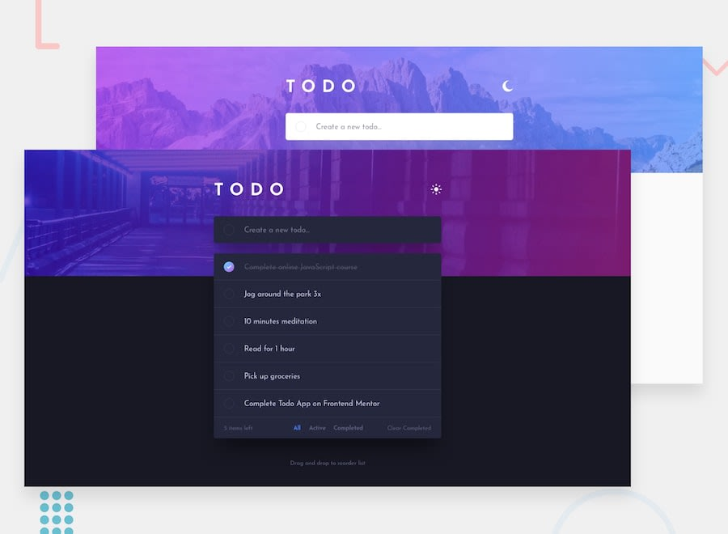

# TODO App

### Tools

- [React.js](https://reactjs.org/)
- [Redux](https://redux.js.org/)
- [Styled Components](https://styled-components.com/)
- [Axios](https://axios-http.com/)
- [Mysql](https://www.mysql.com/)
- [Node.js](https://nodejs.org/)
- [React Hook Form](https://react-hook-form.com/)

### Development

A TODO app built using React and connected to Mysql database using Node.js. The app permits an user to create, delete, edit and clear completed tasks. Moreover the TODOS can be filtered by currently active or completed. Also the app features a dark mode created using Styled Components. The HTTP requests are handled via Axios.
